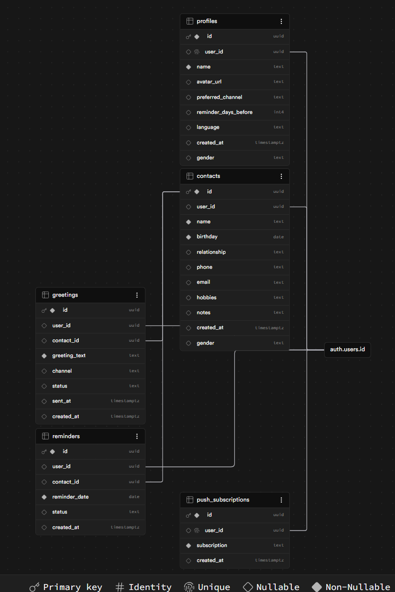

# BirthdayAI 🎂

## סקירה כללית

BirthdayAI היא אפליקציית ווב שמזכירה ימי הולדת ויוצרת ברכות אישיות בעזרת AI ושולחת אותן לוואטסאפ או מייל בלחיצת כפתור.

## הבעיה שהפרויקט פותר

אנשים עסוקים שוכחים לברך את יקיריהם ביום הולדתם, או לא יודעים מה לכתוב כשהם זוכרים.

## קהל היעד

אנשים עסוקים שרוצים לשמור על קשרים חברתיים ומשפחתיים בלי להשקיע זמן רב. כולל מנהלי משאבי אנוש שרוצים לברך עובדים.

## מתחרים ובידול

| מתחרה | מה חסר |
|--------|---------|
| פייסבוק | ברכה גנרית, לא שולח לוואטסאפ |
| גוגל קלנדר | רק מזכיר, לא יוצר ברכה |
| Moonback | אין AI אישי, אין שליחה אוטומטית |

BirthdayAI הוא היחיד שמשלב: תזכורת + ברכה אישית מ-AI + שליחה בלחיצת כפתור + תמיכה ב-3 שפות.

## קישור לפרויקט החי

https://birthdayai-ten.vercel.app

## שירותים חיצוניים ואינטגרציות

| שירות | סוג | תפקיד |
|--------|-----|--------|
| Supabase | Backend + DB | מסד נתונים, אימות משתמשים, RLS |
| Google OAuth | אימות | התחברות עם חשבון גוגל |
| OpenAI API | AI | יצירת ברכות אישיות |
| EmailJS | מייל | טופס יצירת קשר |
| Vercel | Hosting | אחסון ופריסה |
| Supabase Edge Functions | שרת | שליחת Push Notifications |
| Web Push API | התראות | תזכורות יום הולדת |

## טכנולוגיות

- **Frontend:** Vite + React + React Router
- **Backend:** Supabase (PostgreSQL, Auth, RLS, Edge Functions)
- **AI:** OpenAI GPT-4o-mini
- **Deploy:** Vercel
- **PWA:** vite-plugin-pwa

## תרשים ERD


## הרצה מקומית

1. Clone the repo
2. `npm install`
3. צור קובץ `.env` עם:
   ```
   VITE_SUPABASE_URL=...
   VITE_SUPABASE_PUBLISHABLE_KEY=...
   VITE_OPENAI_API_KEY=...
   VITE_VAPID_PUBLIC_KEY=...
   ```
4. `npm run dev`

## משתמש דמו לבדיקה

- **Email:** test@birthdayai.com
- **Password:** test1234
